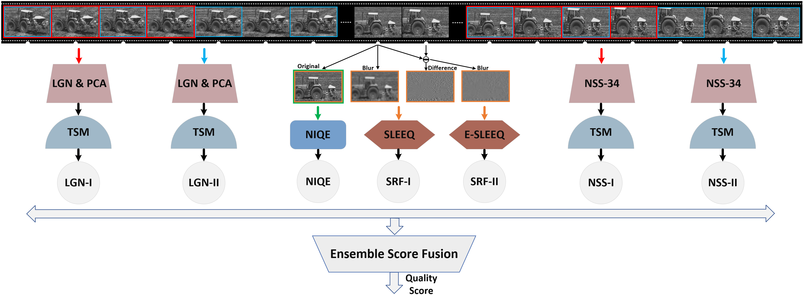
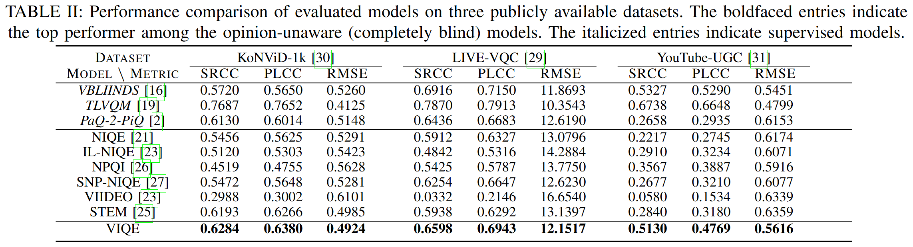

<div align="center">
  <h1><a href="https://ieeexplore.ieee.org/document/9921340">A Completely Blind Video Quality Evaluator</a></h1> 
  


    IEEE Signal Processing Letters, 2022
<div style="width: 50%; text-align: center; margin:auto;">
</div> 

<div>
      Qi Zheng<sup>1</sup>,
      Zhengzhong Tu<sup>2</sup>,
      Xiaoyang Zeng<sup>1</sup>,
      Alan C. Bovik<sup>2</sup>,
      Yibo Fan<sup>1</sup>
  </div>
  <div>
  <sup>1</sup>Fudan University, <sup>2</sup>The University of Texas at Austin
       </div>   

  <h2>Framework</h2> 

<div style="width: 100%; text-align: center; margin:auto;">
      
</div>

<h2>Main Results</h2> 
<div style="width: 100%; text-align: center; margin:auto;">
      
</div>

</div>

## Quicker Start 
### 1. LGN-I and LGN-II scores
- Compute LGN & PCA
```shell
run src/compute_LGN6_feat.m
```
- Compute score
```shell
run src/LGN6_process.m
```

### 2. NIQE score
```shell
run src/compute_NIQE_score.m
```

### 3. SRF-I and SRF-II scores
- Compute SLEEQ and E-SLEEQ scores
```shell
run src/compute_SLEEQ_feat.m
```

### 4. NSS-I and NSS-II scores
- Compute NSS-34 features
```shell
run src/compute_nss34_feat.m
```

- Compute scores
```shell
run src/NSS34_process.m
```

### 5. Scores Fusion 
Video-level socres are obtained by a weighted sum of above seven scores with prior weights. Fusion scores of three evaluated databases are provided in ./features.

### 6. Performance Evaluation
```shell
bash run_all_bvqa_regression_by_content.sh
```
